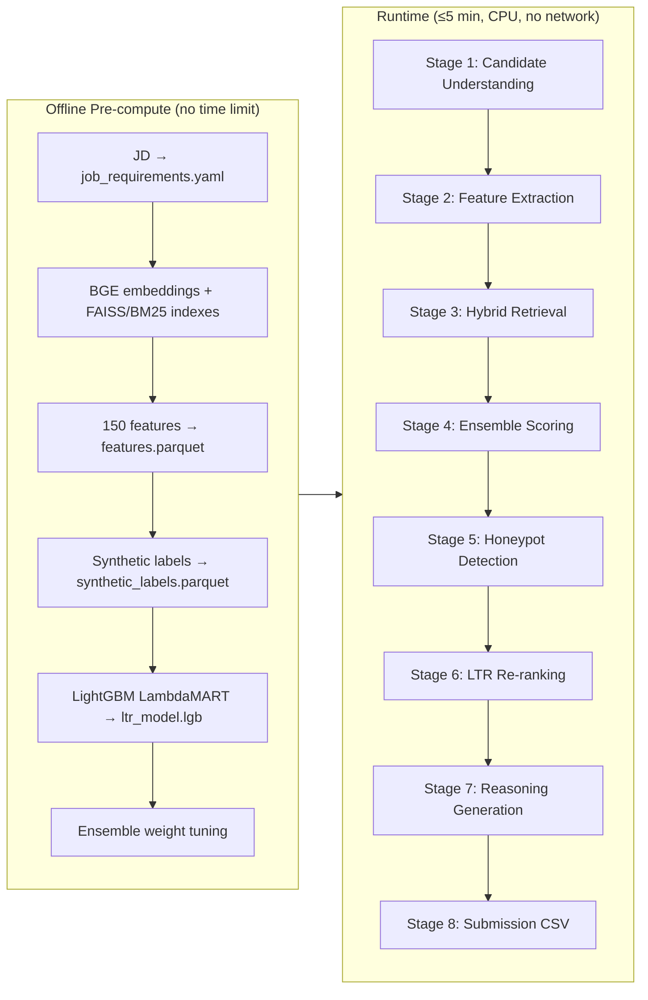

# Redrob Candidate Intelligence & Ranking Engine

Production-grade pipeline that ranks the **top 100** candidates from **100,000** profiles for the Redrob **Senior AI Engineer — Founding Team** role. The system optimizes for hidden evaluation metrics (NDCG@10, honeypot resistance, evidence-based reasoning) rather than naive keyword overlap.

---

## Problem Statement

The Redrob hackathon requires ranking 100,000 candidate profiles against a nuanced job description. Evaluation explicitly penalizes:

- **Keyword-only rankers** — skill-list overlap without career evidence
- **Honeypot exposure** — impossible or fabricated profiles in the top 100 (>10% = Stage 3 disqualification)
- **Generic or hallucinated reasoning** — claims not grounded in profile data
- **Non-reproducible systems** — must run under CPU-only, 16 GB RAM, 5-minute, no-network constraints

Hidden scoring weights: **NDCG@10 (50%)**, NDCG@50 (30%), MAP (15%), P@10 (5%).

The JD's core insight: *find candidates whose career evidence matches what the role **means**, not whose skills list matches what the JD **lists**.*

---

## Architecture — 8-Stage Pipeline

Offline pre-computation (embeddings, features, LTR model) feeds a runtime pipeline that parses profiles, scores, re-ranks, generates evidence-based reasoning, and writes a submission CSV.



| Stage | Name | Output |
|-------|------|--------|
| 1 | Candidate Understanding | Structured `CandidateProfile` |
| 2 | Feature Extraction | 150 numeric features + evidence graph |
| 3 | Hybrid Retrieval | BM25 + FAISS RRF → ~5,000 recall pool |
| 4 | Ensemble Scoring | 7-component weighted score over full pool |
| 5 | Honeypot Detection | Trust scores + penalties applied |
| 6 | LTR Re-ranking | LightGBM on top ~2,000 → top 100 |
| 7 | Reasoning Generation | Evidence-graph template fill (no hallucination) |
| 8 | Submission Generation | Validated CSV output |

See [docs/architecture.md](docs/architecture.md) for detailed stage specifications.

---

## Key Differentiators

### Honeypot Detection Engine

Seven specialized detectors (timeline impossibility, skill inflation, keyword stuffing, fake seniority, behavioral outliers, education anomalies, role–skill mismatch) fused via noisy-OR into a `honeypot_probability` score. Hard gates exclude high-risk profiles from the top 100.

**Target:** 0 honeypots in top-10; ≤2 in top-100 (well under the 10% disqualifier).

### Evidence Graph

Each candidate gets a structured graph of nodes (Skills, Experience, Projects, Signals, Behavior, Availability, Requirements) and edges (`supports_requirement`, `contradicts_requirement`, `risk_signal`, etc.). Reasoning is generated by filling templates from verified graph nodes only — no LLM hallucination at runtime.

### Hybrid LTR Scoring

Coarse ranking uses a hand-tuned 7-component ensemble with hard gates. Fine ranking applies **LightGBM LambdaMART** (NDCG@10 objective) on the top ~2,000 candidates. Retrieval combines **BGE-small-en-v1.5** dense embeddings (FAISS HNSW) with **BM25** via reciprocal rank fusion.

---

## Quick Start

### 1. Install dependencies

```bash
pip install -r requirements.txt -r requirements-precompute.txt
```

Requires Python ≥3.11. `requirements-precompute.txt` adds `sentence-transformers` for offline embeddings only. No GPU packages; no network needed at ranking time.

### 2. Pre-compute artifacts (first time only)

Offline step builds features, embeddings, indexes, synthetic labels, LTR model, and tuned ensemble weights. Expect **~215 minutes** from scratch on 100K (embeddings dominate; ~66 sec for features alone). Skips embedding step if `artifacts/embeddings.npy` already exists.

```bash
python scripts/precompute_all.py --candidates India_runs_data_and_ai_challenge/candidates.jsonl
```

Chain: `build_features` → `build_embeddings` → `build_indexes` → `build_synthetic_labels` → `train_ltr` → `tune_ensemble_weights`.

Large artifacts are gitignored — bundle `artifacts/` with your submission or rebuild locally before ranking.

Use `--skip-tune` to skip ensemble weight tuning during development.

### 3. Rank candidates

```bash
python rank.py --candidates India_runs_data_and_ai_challenge/candidates.jsonl --out ./submission.csv
```

Optional flags: `--artifacts artifacts`, `--config config`, `--top-n 100`.

Requires pre-computed artifacts in `artifacts/`. This is the **reproduce command** declared in `submission_metadata.yaml`. Measured runtime: **81 seconds** on 100K (CPU, 16 GB RAM, no network).

---

## Evaluation

Run local evaluation against synthetic labels before submitting:

```bash
python scripts/evaluate.py \
  --labels artifacts/synthetic_labels.parquet \
  --pred submission.csv \
  --features artifacts/features.parquet
```

Additional audit scripts:

```bash
python scripts/audit_honeypots.py --submission submission.csv --features artifacts/features.parquet
python scripts/audit_traps.py --submission submission.csv --features artifacts/features.parquet \
  --candidates India_runs_data_and_ai_challenge/candidates.jsonl
python scripts/audit_reasoning.py \
  --submission submission.csv \
  --candidates India_runs_data_and_ai_challenge/candidates.jsonl
python India_runs_data_and_ai_challenge/validate_submission.py submission.csv
```

Run the test suite:

```bash
pip install -r requirements-dev.txt
pytest
```

See [docs/methodology.md](docs/methodology.md) for synthetic label tiers, metrics, and the pre-submission checklist.

---

## Compute Constraints

The ranking step (`rank.py`) must satisfy hackathon limits:

| Constraint | Requirement |
|------------|-------------|
| CPU only | No GPU inference at ranking time |
| RAM | ≤16 GB |
| Wall time | ≤5 minutes end-to-end |
| Network | No API calls or embedding inference during ranking |

Pre-computation (embeddings, training) is allowed offline with no time limit. All artifacts are loaded from disk at runtime.

Estimated runtime budget:

| Phase | Measured / target |
|-------|-------------------|
| Load artifacts + parse 100K | ~20–40 s |
| ANN + BM25 retrieval | ~5–10 s |
| Ensemble scoring | ~10–20 s |
| LTR re-rank (top 2K) | ~1–2 s |
| Reasoning + CSV write (top 100) | ~5–15 s |
| **Total** | **81 s measured** (≤5 min limit) |

### Verified local results

| Metric | Result |
|--------|--------|
| NDCG@10 (synthetic labels) | 1.0 |
| honeypot@100 | 0 |
| keyword-stuffer@10 | 0 |
| reasoning violations | 0 |

---

## Project Structure

```
├── rank.py                    # Main entrypoint
├── submission_metadata.yaml   # Hackathon submission metadata
├── config/                    # JD requirements, ensemble weights
├── artifacts/                 # Pre-computed embeddings, features, LTR model
├── src/                       # Pipeline source (understanding, retrieval, scoring, etc.)
├── scripts/                   # Precompute, evaluate, audit scripts
├── tests/                     # Unit and integration tests
├── sandbox/                   # Streamlit demo (optional)
└── docs/                      # Architecture, methodology, presentation outline
```

---

## Submission

Fill in [submission_metadata.yaml](submission_metadata.yaml) before portal upload (team info, GitHub repo, sandbox link, compute env, AI tools declaration).

**Streamlit Cloud (sandbox):** [share.streamlit.io](https://share.streamlit.io) → New app → repo `anuraggjena/redrob-ai-challenge` → main file `sandbox/app.py` → Advanced settings → Requirements file: `sandbox/requirements.txt` → Deploy.

---

## Documentation

- [docs/architecture.md](docs/architecture.md) — Detailed 8-stage pipeline specifications
- [docs/methodology.md](docs/methodology.md) — Synthetic labels, metrics, submission checklist
- [docs/ppt_outline.md](docs/ppt_outline.md) — 10-slide presentation outline

---

## License

Built for the Redrob Intelligent Candidate Discovery & Ranking Challenge.
