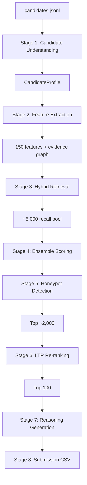

# Architecture — Redrob Ranking Engine

Detailed specifications for the eight-stage candidate ranking pipeline.

---

## Overview

The system separates **offline pre-computation** (no time limit) from **runtime ranking** (≤5 min, CPU-only, 16 GB RAM, no network). All stages consume a central `CandidateProfile` object — raw JSON is parsed once in Stage 1 and never re-parsed downstream.



---

## CandidateProfile Schema

Central structured representation consumed by all stages:

```
CandidateProfile
├── identity: candidate_id
├── narrative: normalized headline, summary
├── experience: total_years, relevant_years, ai_years, ranking_years, retrieval_years, python_years, startup_years, product_company_years
├── career: roles[], progression_score, company_types[], tenure_stats
├── technical: skill_evidence[], responsibility_hits[], domain_tags[]
├── behavioral: normalized redrob_signals (0-1 scale)
├── availability: notice_period_days, relocate, work_mode, activity_recency_days
├── trust: honeypot_probability, consistency_score, trustworthiness
├── evidence_graph: nodes[], edges[], support_score, contradict_score
└── features: Dict[str, float]  # 150 materialized features
```

---

## Stage 1 — Candidate Understanding Engine

**Location:** `src/understanding/`

Parses raw candidate JSON into a structured `CandidateProfile` with normalized fields, validated timelines, and extracted career signals.

| Extractor | Responsibility |
|-----------|----------------|
| `ExperienceExtractor` | Total/relevant/AI/ranking/retrieval/Python/startup/product-company years from career history |
| `CareerExtractor` | Title progression, tenure quality, company type classification, industry trajectory |
| `TechnicalExtractor` | Skill evidence weighted by proficiency × duration × endorsements; responsibility phrase extraction from role descriptions |
| `BehavioralExtractor` | Normalize 23 `redrob_signals` to 0–1; handle `-1` sentinels as unknown |
| `AvailabilityExtractor` | Notice period curve, India location fit (Pune/Noida/Tier-1), work mode, last_active recency |
| `TimelineValidator` | Overlap/gap detection, education–career consistency, impossible date flags |

**Title–skill coherence:** Non-technical title + dense AI skill list → `role_skill_mismatch` flag (feeds honeypot detection).

---

## Stage 2 — Feature Engineering

**Location:** `src/features/`, cached in `artifacts/features.parquet`

Computes 150 numeric features once per candidate (cached in `artifacts/features.parquet`, ~12.8 MB for 100K rows). Feature groups:

| Group | Count | Examples |
|-------|-------|----------|
| Experience ratios | ~15 | `relevant_experience_ratio`, `production_ml_ratio`, `ranking_experience_ratio`, `retrieval_experience_ratio`, `startup_experience_ratio` |
| Career trajectory | ~12 | `career_growth_score`, `job_hopping_score`, `product_company_ratio`, `consulting_only_flag` |
| Technical depth | ~20 | `retrieval_depth`, `ranking_depth`, `eval_maturity`, `vector_db_experience`, `python_depth` |
| Semantic match | ~15 | BM25, dense cosine, RRF, skill/responsibility/career/domain/seniority/intent/production/ranking/retrieval match |
| Behavioral | ~12 | `engagement_score`, `responsiveness_score`, `recruiter_interest`, `hireability_proxy` |
| Availability | ~8 | `availability_score`, `notice_penalty`, `location_fit`, `active_job_seeker` |
| Trust/honeypot | ~15 | `honeypot_probability`, `trustworthiness`, `profile_consistency`, `keyword_stuffing_score` |
| Recruiter intelligence | ~12 | `technical_depth_score`, `production_experience_score`, `startup_readiness`, `engineering_ownership`, `product_mindset_score` |
| Graph evidence | ~8 | `support_edge_count`, `contradict_edge_count`, `strong_signal_ratio`, `evidence_confidence` |
| Cross/interaction | ~10 | `title_skill_coherence`, `behavioral_x_technical`, `experience_x_production` |

---

## Stage 3 — Hybrid Retrieval

**Location:** `src/retrieval/`

Dense-first hybrid retrieval builds a high-recall pool before expensive scoring.

**Document text per candidate:**
```
{headline} | {summary} | {current_title} @ {current_company} | {career descriptions} | {skills with proficiency}
```

**Query (from parsed JD in `config/job_requirements.yaml`):**
- Dense: full JD embedding (BGE-small-en-v1.5, 384-d)
- BM25: required skills, responsibility phrases, positive/negative signal terms

**Indexes:** Offline-built FAISS HNSW index (~172 MB) + BM25 inverted index (~373 MB).

**Fusion:** Reciprocal Rank Fusion (k=60) of FAISS top-10K + BM25 top-10K + feature-gated boost for candidates with ranking/retrieval experience evidence.

**Output:** Union top ~5,000 IDs passed to ensemble scoring (recall pool, not final rank).

---

## Stage 4 — Ensemble Scoring

**Location:** `src/scoring/ensemble_scorer.py`, weights in `config/feature_weights.yaml`

Hand-tuned 7-component weighted ensemble with hard gates:

```
final_coarse =
  0.30 × technical_fit
+ 0.20 × semantic_fit
+ 0.15 × experience_fit
+ 0.10 × behavioral_fit
+ 0.10 × recruiter_signal_fit
+ 0.10 × availability_fit
+ 0.05 × trustworthiness
− honeypot_penalty
− keyword_stuffer_penalty
```

Weights are tuned against synthetic NDCG@10 via `scripts/tune_ensemble_weights.py`.

**Hard gates:**
- `honeypot_probability > 0.7` → exclude from top-100
- Consulting-only career + no product experience → cap at rank 500
- Pure CV/speech/robotics without NLP/IR → cap at rank 300
- `recruiter_response_rate < 0.1` AND `days_since_active > 180` → availability crush

Top ~2,000 by coarse score proceed to LTR re-ranking.

---

## Stage 5 — Honeypot Detection Engine

**Location:** `src/honeypot/`

Seven specialized detectors fused via noisy-OR: `honeypot_probability = 1 − ∏(1 − detector_i_score)`.

| Detector | Detects |
|----------|---------|
| `TimelineImpossibilityDetector` | Experience at company before founding; total months implausible |
| `SkillInflationDetector` | Expert proficiency + 0 duration; 25+ skills, thin career |
| `KeywordStufferDetector` | High JD skill overlap, low responsibility evidence, title mismatch |
| `FakeSeniorityDetector` | Senior title with <3 yrs total; title jumps without tenure |
| `BehavioralOutlierDetector` | Perfect profile + zero engagement |
| `EducationAnomalyDetector` | Future degree dates; tier vs career incoherence |
| `RoleSkillMismatchDetector` | Non-technical title + dense AI skill list |

**Targets:** 0 honeypots in top-10; ≤2 in top-100 (well under 10% Stage 3 disqualifier).

Penalties are applied in ensemble scoring; high-probability profiles are hard-gated from the final top 100.

---

## Stage 6 — LTR Re-ranking

**Location:** `src/scoring/ltr_ranker.py`, model at `artifacts/ltr_model.lgb`

- **Model:** LightGBM `lambdarank`, objective NDCG@10
- **Training data:** Synthetic relevance tiers from `scripts/build_synthetic_labels.py`
- **Protocol:** LightGBM query groups (≤10K rows per group for 100K training set); `rank_xendcg` fallback if `lambdarank` fails; fall back to ensemble if model file missing
- **Inference:** Score top-2K → sort descending → take top-100

No embedding inference or API calls at ranking time — model loaded from disk.

---

## Stage 7 — Reasoning Generation

**Location:** `src/reasoning/`, graph in `src/graph/`

Generates 1–2 sentence justifications from the evidence graph only.

**Evidence graph node types:** Skills, Experience, Projects, Signals, Behavior, Availability, Requirements

**Edge types:** `supports_requirement`, `contradicts_requirement`, `risk_signal`, `strong_signal`, `weak_signal`

**Template (slots filled only from verified graph nodes):**
```
"{relevant_years} yrs {primary_domain}; {strength_1} and {strength_2}; {concern_if_any}."
```

**Rules:**
- Every claim maps to a graph node — no fabrication
- Omit concern clause if no evidence (never invent negatives)
- Substantively different reasoning per rank band
- Pre-submission validation: `scripts/audit_reasoning.py`

**Hallucination guard:** `src/reasoning/hallucination_guard.py` validates claims against profile fields before output.

---

## Stage 8 — Submission Generation

**Location:** `src/submission/csv_writer.py`

Output CSV columns: `candidate_id,rank,score,reasoning`

- Exactly 100 rows, ranks 1–100, scores monotonically non-increasing
- Tie-break: `candidate_id` ascending
- Validated by bundled `India_runs_data_and_ai_challenge/validate_submission.py`

---

## Offline Pre-computation Pipeline

**Script:** `scripts/precompute_all.py`

| Step | Script | Artifact | Measured time (100K) |
|------|--------|----------|----------------------|
| 1 | `build_features.py` | `artifacts/features.parquet` | ~66 s |
| 2 | `build_embeddings.py` | `artifacts/embeddings.npy`, `candidate_ids.json` | ~212 min (skipped if exists) |
| 3 | `build_indexes.py` | FAISS HNSW + BM25 + `query_embedding.npy` | ~185 s |
| 4 | `build_synthetic_labels.py` | `artifacts/synthetic_labels.parquet` | ~10 s |
| 5 | `train_ltr.py` | `artifacts/ltr_model.lgb` | ~16 s |
| 6 | `tune_ensemble_weights.py` | `config/feature_weights.yaml` | optional |

---

## Memory Budget (16 GB)

| Artifact | Measured / est. size |
|----------|----------------------|
| FAISS index (100K × 384d) | ~172 MB |
| BM25 postings | ~373 MB |
| Feature matrix (100K × 150 × 4B) | ~12.8 MB (parquet) |
| Embeddings (100K × 384d float32) | ~146 MB |
| CandidateProfile objects | ~2–3 GB |
| LTR model + overhead | ~1.2 MB |
| Headroom | ~12 GB |

---

## Error Handling

| Failure | Handling |
|---------|----------|
| Missing optional fields | Default empty; never crash |
| Malformed dates | Flag in timeline validator |
| `-1` sentinels (github, offer_rate) | Treat as unknown |
| Equal scores | Tie-break `candidate_id` ascending |
| Missing LTR model | Fall back to ensemble-only |
| Stale feature cache | Hash candidates file; rebuild if mismatch |

---

## Dependencies

Runtime ranking requires: `faiss-cpu`, `lightgbm`, `rank-bm25`, `numpy`, `pandas`, `pyarrow`, `orjson`, `joblib`, `scikit-learn`, `pyyaml`.

Pre-compute only: `sentence-transformers` (BGE-small-en-v1.5 embeddings).

No LangChain, no API clients, no GPU packages at ranking time.
